<div align="center">

# MSP-Platform

**Hisar Research Managed Service Provider Platform**

Yayındaki **39 yönetilen hizmeti** uçtan uca teslim eden otomasyon platformu.
Sözleşme imzalanır, hak seti derlenir, işler altı yürütme şeridine dağıtılır — sahada kimse olmadan.


[Belgeler](docs/) · [Emülasyon demosu](demo/) · [Mimari](docs/architecture.md) · [Secret yönetimi](docs/secrets.md)

</div>

---

## Altı yürütme şeridi

Katalogdaki her hizmet, onu **fiilen yapan şeye** bağlıdır. Aracı yazılım bunların yalnız
ikisini taşır; ağırlık merkezi uzaktan yapılandırma ve insan işi tarafındadır.

<picture>
  <source media="(prefers-color-scheme: dark)" srcset="docs/assets/seritler-dark.svg">
  
</picture>

| Şerit | Ne yürütür | Kod |
|-------|-----------|-----|
| **A** | Uç cihaz ajanı — durum bildirir, tanımı çeker, uygular | [`agent/`](agent/) |
| **B** | Ansible ile uzaktan ayar — üzerine program kurulamayan cihazlar | [`relay/ansible/`](relay/ansible/) |
| **C** | Sağlayıcı arayüzleri — bulut, yedekleme, sanallaştırma | [`platform/app/integrations/`](platform/app/integrations/) |
| **D** | Kendi sistemlerimizde kurulum — izleme, envanter, destek kuyruğu | [`platform/app/services/`](platform/app/services/) |
| **E** | Takvimli tekrar eden işler — rapor, tarama, geri yükleme testi | [`orchestrator/workflows/`](orchestrator/workflows/) |
| **F** | İnsan iş emri — saha, nöbet, danışmanlık | [`human/`](human/) |

---

## Beş bileşen

<picture>
  <source media="(prefers-color-scheme: dark)" srcset="docs/assets/kod-haritasi-dark.svg">
  
</picture>

| # | Bileşen | Klasör | Ne yapar |
|---|---------|--------|----------|
| 1 | **Orkestratör (n8n)** | [`orchestrator/`](orchestrator/) | Sözleşme imzalanınca görev listesini derletir, işi şeritlere dağıtır, tekrar eden işleri takvimde koşturur |
| 2 | **HR Platformu** | [`platform/`](platform/) | Beyin: katalog, hak seti, tanım derleyici, denetim kaydı, entegrasyonlar |
| 3 | **Site Relay** | [`relay/`](relay/) | Müşteri sahasındaki aracı düğüm: iş kuyruğu, AWX yürütme düğümü, izleme vekili, paket önbelleği |
| 4 | **İnsan** | [`human/`](human/) | İş emri şablonları, yetki belgeleri, kabul kriterleri, runbook'lar |
| 5 | **Uç Nokta Ajanı** | [`agent/`](agent/) | Uç cihazda koşan Python ajanı — kendi kararı yok, bağlantıyı hep kendisi kurar |

> **Yön kuralı.** Müşteri ağına giden her bağlantı içeriden başlatılır. Relay ve ajan
> dışarı arar; dışarıdan içeri kimse aramaz. Müşterinin güvenlik duvarında bizim için
> tek bir gelen kural açılmaz.

---

## Uçtan uca emülasyon

Platformun tamamı — beş bileşen, altı ağ bacağı, 19 düğüm — gerçek konteynerler ve gerçek
ağ cihazlarıyla ayağa kalkar. Kutuların içinde **deponun kendi kodu** koşar.

<picture>
  <source media="(prefers-color-scheme: dark)" srcset="docs/assets/topoloji-dark.svg">
  
</picture>

```bash
cd demo
./scripts/up.sh              # imajları derler, topolojiyi kurar
./scripts/ag-dogrula.sh      # altı ağ bacağını kanıtlar
./scripts/demo-uctan-uca.sh  # sözleşmeden çalışan hizmete senaryo
```

<details>
<summary><b>Son koşuda ölçülenler — 33 kontrolün 33'ü geçti</b></summary>

<br>

| Ölçüm | Sonuç |
|-------|-------|
| Site relay → HR platformu (dört bacak üzerinden) | **HTTP 200** |
| HR platformu → relay API'si | **engellendi** |
| HR platformu → sunucu VLAN'ı | **engellendi** |
| Receptor mesh | `relay-acme ↔ hr-awx-hop` kuruldu |
| Kasa, başka kiracının alanı istendiğinde | **403** |
| Aynı VLAN / farklı VLAN / WAN ötesi | TTL **64 / 63 / 61** |
| Ajan çalıştıramayan düğümlerde ajan | **yok** (ayrıca denetlendi) |

Emülasyon gerçek bir hata da yakaladı: `relay_api/queue.py` Python'un standart
kütüphanesindeki `queue` modülüyle çakışıyordu ve relay API'si 500 döndürüyordu.
`jobqueue.py` olarak yeniden adlandırıldı.

Ayrıntı: [`demo/README.md`](demo/README.md) · Görsel demonstrasyon: [`docs/demo/`](docs/demo/)

</details>

---

## Secret yönetimi — istisnasız

Hiçbir parola, anahtar veya sertifika kaynak koda yazılmaz.

| Nerede çalışıyor | Kasa |
|------------------|------|
| Agent ve makinede koşan script'ler | `.env` |
| Ansible adımları | `ansible-vault` |
| n8n iş akışları ve arayüz çağrıları | n8n credentials |
| Platform arka ucu | ortam değişkeni → [`platform/app/config.py`](platform/app/config.py) |

Her hizmetin **ilk görevi** erişim bilgilerinin kasaya yazılmasıdır; katalog yükleyici bunu
zorunlu tutar ve aksi hâlde platform açılışta hata verir. Sürekli tümleştirme hattı şifresiz
vault dosyasını, depoya girmiş `.env`'i ve açık metin sır kalıplarını reddeder.

---

<details>
<summary><b>Hızlı başlangıç</b></summary>

<br>

```bash
# Platform
cd platform && python -m venv .venv && . .venv/bin/activate
pip install -e ".[dev]" && cp .env.example .env
uvicorn app.main:app --reload

# Agent (geliştirme)
cd agent && pip install -e ".[dev]" && cp .env.example .env
python -m hragent --once

# Relay (müşteri sahası)
cd relay && cp .env.example .env && docker compose up -d
```

Testler:

```bash
cd platform && python -m pytest -q   # 20 test
cd agent    && python -m pytest -q   # 12 test
```

</details>

<details>
<summary><b>Belgeler</b></summary>

<br>

| Belge | İçerik |
|-------|--------|
| [`docs/architecture.md`](docs/architecture.md) | Kontrol düzlemi / yürütme düzlemi, relay'in neden n8n worker'ı olmadığı, emülasyon ölçümleri |
| [`docs/secrets.md`](docs/secrets.md) | Kasa kullanımı ve sürekli tümleştirme korumaları |
| [`docs/hizmet-seritleri/`](docs/hizmet-seritleri/) | Teslim mimarisi: 39 hizmetin altı şeride eşlenmesi (etkileşimli + PDF) |
| [`docs/kod-haritasi/`](docs/kod-haritasi/) | Bu deponun kod topolojisi; `build.py` ile yeniden üretilir |
| [`docs/demo/`](docs/demo/) | Emülasyonun görsel demonstrasyonu (HTML + PDF) |
| [`demo/`](demo/) | Emülasyon ortamının kendisi: topoloji, imajlar, betikler |

Bu README'deki şemalar depodaki veriden üretilir:

```bash
python3 docs/assets/build_svg.py
```

</details>

---

<div align="center">
<sub>Hizmet adları ve paket içerikleri <code>pre-sales.hisarresearch.com</code> ile aynı kimliklere bağlıdır —
tek katalog, iki yüz: satış yüzü sitede, teslim yüzü burada.</sub>
</div>
